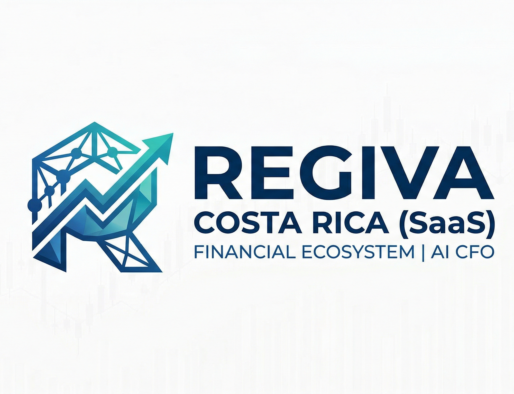

<div align="center">
  
  
  <h1>REGIVA Costa Rica (SaaS)</h1>

  [](#)
  [](#)
  [](#)
  [](#)
  [](#)

  <p>The Financial Ecosystem and "Autonomous CFO" for SMEs in Costa Rica.</p>
</div>

---

## Overview

**REGIVA** is a SaaS platform designed to eliminate "financial blindness" for Costa Rican Small and Medium Enterprises (SMEs). It operates beyond standard electronic invoicing, it is a **financial intelligence** tool that combines mandatory tax compliance (Hacienda v4.4) with Artificial Intelligence models to project cash flows and calculate alternative credit scores.

The system is built upon a secure **Multi-Tenant** architecture, allowing the management of multiple isolated companies within a single database through `tenant_id` discrimination.

---

## Technology Stack

The project follows an N-Layer architecture, integrating the following modern services:

| Layer | Technology |
|---|---|
| **Backend** | ASP.NET Core 8 (MVC + Web API) |
| **Database** | PostgreSQL 16 with Npgsql |
| **Data Access** | Repository Pattern with Dapper (high performance) |
| **Frontend** | Razor Views, Bootstrap, jQuery |
| **Artificial Intelligence** | Python — Pandas, Scikit-learn, LSTM |
| **Infrastructure** | Ministry of Finance (Hacienda) API (OAuth 2.0 / OIDC) |

---

## Core Modules

### 1. Multi-Tenant Core
- Logical data isolation via `tenant_id`.
- User and role management (`tenant_users`).
- Comprehensive security and auditing (`created_at`, `updated_by`, system logs).

### 2. Electronic Invoicing (Hacienda v4.4)
- **Supported Documents:** Electronic Invoices, Tickets, Credit/Debit Notes, and Acceptance Messages.
- **Validations:** Direct integration with the CABYS catalog and XSD schema validation.
- **Electronic Payment Receipt (REP):** Accurate calculation of Days Sales Outstanding (DSO) by correlating invoices with payments.
- **XML Storage:** Secure management of signed XML files and official responses from Hacienda.

### 3. Artificial Intelligence (Python Engine)
- **Cash Flow Projections:** Predictive LSTM models designed to estimate 30-day liquidity.
- **Credit Scoring:** A *Random Forest* algorithm that evaluates customer payment behavior (scoring 0–100) without relying on traditional credit bureaus.
- **Anomaly Detection:** A "Tax Shield" feature that identifies unusual spending patterns to prevent financial discrepancies.

---

## Database Structure

The `regiva_cr` database is designed in Third Normal Form (**3NF**) and includes the following key schemas:

| Table(s) | Purpose |
|---|---|
| `tenants` & `users` | Access control and company management |
| `electronic_documents` & `document_lines` | Primary transactional records |
| `payment_receipts` | Traceability of partial and full payments |
| `cash_flow_projections` & `credit_scores` | Outputs generated by the AI models |

> **Note:** A **Soft Delete** pattern (`deleted_at`) is implemented across all transactional tables to preserve data integrity.

---

## Installation and Configuration

### Prerequisites

- [.NET 8.0 SDK](https://dotnet.microsoft.com/download)
- [PostgreSQL 14+](https://www.postgresql.org/download/)
- [Python 3.11+](https://www.python.org/)
- [DBeaver](https://dbeaver.io/) *(recommended for database management)*

### 1. Clone the Repository

```bash
git clone [https://github.com/your-username/regiva-cr.git](https://github.com/your-username/regiva-cr.git)
cd regiva-cr
